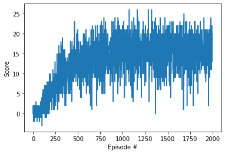
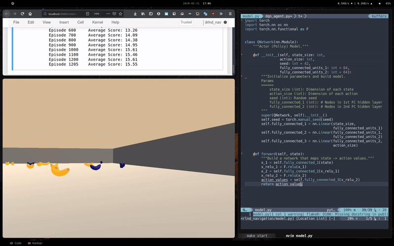

# Solving the DRLND Unity Navigation Environment

Train an agent to solve the `Banana` Unity Environment from the Deep Reinforcement
Learning Nanodegree on Udacity.





After 600 episodes of training, the agent achieved an average score of +13 over
100 consecutive episodes. The trained agent playing in the left GIF above
achieved a score of +12 in that instance.

The  task was solved using a simple DQN
architecture without imporovements on the 37 dimensional state vector.

## Training




## Prerequisites

- `conda` or `miniconda` (recommended)
- `make`
- Download the environment that matches your OS following the *Getting Started* from the DRLND
  [repo](https://github.com/udacity/deep-reinforcement-learning/blob/master/p1_navigation/README.md#getting-started)
  and unpack it in the root of this project

## Install Environment

### Automated Install

Simply run `make install` to install all requirements in a `conda` environment
called `drlnd_nav`.

### Manual Install

Create a `conda` environment called `drlnd_nav` with Python3.6 and activate it
using the following commands

```zsh
conda create --name drlnd_nav python=3.6
conda activate drlnd_nav
```

Then install the requirements file `requirements.txt` and install the drlnd_nav
ipykernel.

```zsh
pip install -r $(PWD)/requirements.txt
python -m ipykernel install --user --name drlnd_nav --display-name "drlnd_nav"
```

## Run the Code

Next, run `make start` to start the Jupyter notebook server and use your favorite
browser to navigate to
[http://localhost:8888/?token=abcd](http://localhost:8888/?token=abcd).

