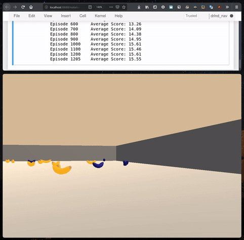
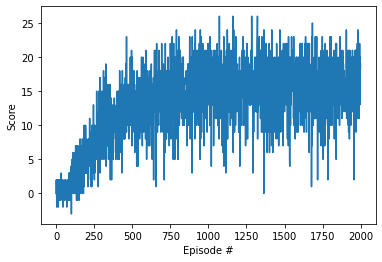

# Description of the Implementation

This document describes the implementation for training an reinforcement
learning (RL) agent to solve the `Banana` [Unity
ML-agents](https://github.com/Unity-Technologies/ml-agents) Environment from the
Deep Reinforcement Learning Nanodegree on Udacity. It includes a detailed
description of the learning algorithm with the used hyperparameters, the
performance over 2000 episodes and concrete ideas for future work to improve the
agent's performance.

## Agent & Environment

As described in [[1]](#udacity-drlnd-repo), the provided environment is a large
and square world built with Unity. The goal is to collect as many yellow bananas
as possible, while avoiding blue bananas on the way.


The learning agent operates in an initially unknown environment. By interacting
with the environment, the agent becomes more competent than its initial
knowledge alone might allow. Learning modifies the agent's components to bring
them into closer agreement with the available feedback information. Given this
feedback, the agent has to learn how to select the best action given a state.

### Task Environment

To design a rational agent, we have to specify the task environment. The
environment in which the agent is acting, is
- partially observable
- deterministic
- episodic
- static
- continuous
- single agent

The environment rewards the agent with `+1` for collecting a yellow banana, and
a `-1` reward for a blue banana. As the performance measure, we define the
average score collected over 100 consecutive episodes. If that average measure
is above +13, the environment is considered solved.

The agent percepts it's environment through a 37 dimensional vector. This vector
contains the agent's velocity and a ray-based perception of objects around
the agent's forward direction.

Interaction with the environment are available to the agent in the form of four
discrete actions that are
- move forward: `0`
- move backward: `1`
- turn left: `2`
- turn right: `3`


## Learning Algorithm

### Deep Q-Network (DQN)

The learning algorithm implemented in this project follows the DQN value-based
method proposed in [[2]](#dqn-nature-2015), which showed human-level control
through deep reinforcement learning. This deep Q-network agent was able to
achieve a comparable level to that of a professional human games tester,
requiring only the raw pixel and game score information. To achieve that, they
replaced the linear function approximator by a nonlinear function approximator
(neural network), which they called the Q-network.

To make it suitable for training large neural networks without diverging due to
harmful correlations, [[2]](#dqn-nature-2015) further integrated two
improvements, named *experience replay* proposed by
[[3]](#experience-replay-1993) and using a separate network that stays fixed for
`C` updates to generate the targets. Experience replay reduces the possibly high
correlation between a sequence of experience tuples by storing experiences in a
*replay buffer* and sampling from it uniformly.

The paper in [[2]](#dqn-nature-2015) gives a good example to understand the
effects of strong correlations between samples.

>  For example, if the maximizing action is to move left then the training samples
>  will be dominated by samples from the left-hand side; if the maximizing action
>  then switches to the right then the training distribution will also switch. It
>  is easy to see how unwanted feedback loops may arise and the parameters could
>  get stuck in a poor local minimum, or even diverge catastrophically.

Using experience replay hence
- **allows for greater data efficiency**, as each step potentially used in many
  weight updates
- **breaks correlations and reduces variance of updates**, by randomizing the
  samples
- next data sample that parameters are trained on is **not determined by current
  parameters**


The second modification in [[2]](#dqn-nature-2015) aimed at making the algorithm
more stable compared to standard online Q-learning. An update that increases the
Q-value of time `t` also frequently increases the Q-value for all actions of
time `t+1` and hence also increases the target. Such online Q-learning methods
can lead to oscillations or divergence of the policy. Adding a delay between the
time an update to `Q` is made and the time the update affects the targets, makes
such divergence or oscillations more unlikely. Therefore, a target network `Q^`
is introduced to compute the targets `y` and updated only every `C` updated to
`Q`.


### Algorithm


### Neural Network Architecture

The neural network composed and used by the DQN agent has
- an input layer whose size depends of the environment `state_size`
  - here 37 and corresponds to the agent's velocity and a ray-based perception
  of objects around the agent's forward direction
- then 2 hidden fully connected layers with a size of 64 nodes
- an output layer whose size depends of the environment `action_size`
  - here 4 and corresponds to the four actions `up`, `down`, `left` and `right`


### Implementation

| File | Description |
| ---- | ----------- |
| `model.py` | Python3 file implementing the Q-Network with [PyTorch](https://pytorch.org/docs/1.5.0) in version 1.5.0. A default fully connected network architecture is implemented as described in [NN Architecture section](#neural-network-architecture). |
| `dqn_agent.py` | Python3 file implementing the DQN agent together with a replay buffer <br> *DQN Agent* <br> - `act()`: In sampling section of [Algorithm 1](#algorithm). Given the current state it returns an epsilon-greedy action according to current policy  <br> - `step()`: Stores last transitions (state, action, reward, next_state) in replay buffer. Every `UPDATE_EVERY` (=4) time steps, the `learn()` subroutine is called with a random sample of transitions stored in the replay buffer.  <br> - `learn()`: Computes and minimizes loss using the given sample of transitions and performs the `soft_update()` to update the target networks weights. |
| `kW_Solution.ipynb` | Jupyter Notebook to train the agent and setting hyperparameters |


### Hyperparameters

+ TODO: Add rest of the hyperparameters

| Name     | Value | Description |
| -------- | ----- | ----------- |
| minibatch size | 64 | Number of training cases for computing the stochastic gradient descent (SGD) update |
| replay buffer size | 100'000 | SGD updates are being sampled from this number of most recent frames |
| target network update frequency | 4 | The frequency with which the target network is updated (Parameter `C`)|
| discount factor | 0.99 | Discount factor `gamma` used in the Q-learning update |
| max timesteps | 1'000 | Maximum number of timesteps per episode |
| interpolation parameter | 0.001 | For a soft update of target parameters |
| learning rate | 0.0005 | The learning rate used by the Adam optimizer |
| initial exploration | 1 | Initial value of ε in ε-greedy exploration |
| final exploration | 0.01 | Final value of ε in ε-greedy exploration |
| final exploration frame | 459'000 | Number of frames over which the initial value of ε is monotonically decreased to its final value |
| replay start size | 4'000 | Uniform random policy is run for this number of frames before learning starts


### Agent Performance

The neural network minimizes the Mean Squared Error (MSE) loss using the `Adam`
optimizer with a learning rate of 0.0005 and a batch size of 64. Using
[this](#neural-network-architecture) architecture and [these](#hyperparameters)
yielded the following results for this environment. The environment was solved
after 600 episodes.




```
  Episode 100     Average Score: 0.38
  Episode 200     Average Score: 3.35
  Episode 300     Average Score: 7.34
  Episode 400     Average Score: 10.01
  Episode 500     Average Score: 12.44
  Episode 600     Average Score: 13.26
  Episode 700     Average Score: 14.09
  Episode 800     Average Score: 14.38
  Episode 900     Average Score: 14.95
  Episode 1000    Average Score: 15.61
  Episode 1100    Average Score: 15.46
  Episode 1200    Average Score: 15.61
  Episode 1300    Average Score: 15.39
  Episode 1400    Average Score: 16.00
  Episode 1500    Average Score: 15.30
  Episode 1600    Average Score: 15.53
  Episode 1700    Average Score: 15.79
  Episode 1800    Average Score: 15.08
  Episode 1900    Average Score: 16.00
  Episode 2000    Average Score: 15.95
```


## Future Work

- Instead of using the 37 dimensional vector provided by the environment, the
  agent could be trained directly using the raw pixels
  - Similar to [[2]](#dqn-nature-2015) this could be done by replacing the input
  layer of the neural network architecture by a Convolutional Neural Network
  (CNN) that processes the raw pixel values
  - Also, the preprocessing steps proposed could be applied, such as rescaling
  the image, converting, stacking `m` most recent frames, etc.
- All the six extensions that were combined in the [[4]](#rainbow-aaai-2015)
  could be implemented to increase the performance
  - [Double DQN (DDQN)](https://arxiv.org/abs/1509.06461)
  - [Dueling DDQN](https://arxiv.org/abs/1511.06581)
  - [Prioritized DDQN](https://arxiv.org/abs/1511.05952)
  - [Asynchronous learning from parallel copies](http://www.jmlr.org/proceedings/papers/v48/mniha16.pdf)
  - [Distributional DQN](https://dl.acm.org/ft_gateway.cfm?id=3305428&type=pdf)
  - [Noisy DQN](https://arxiv.org/pdf/1706.10295)


## Sources

<a name="udacity-drlnd-repo">[1]</a>: *Navigation Project README*. Deep
Reinforcement Learning Nanodegree GitHub repository. Retrieved 1 June 2020,
from
https://github.com/udacity/deep-reinforcement-learning/blob/master/p1_navigation/README.md#project-1-navigation.

<a name="dqn-nature-2015">[2]</a>: Mnih, Volodymyr, et al. "Human-level control
through deep reinforcement learning." Nature 518.7540 (2015): 529-533.

<a name="experience-replay-1993">[3]</a>: Lin, L.-J. Reinforcement learning for robots using neural networks. Technical
Report, DTIC Document (1993).

<a name="rainbow-aaai-2015">[4]</a>: Hessel, Matteo, et al. "Rainbow: Combining
improvements in deep reinforcement learning." Thirty-Second AAAI Conference on
Artificial Intelligence. 2018.
